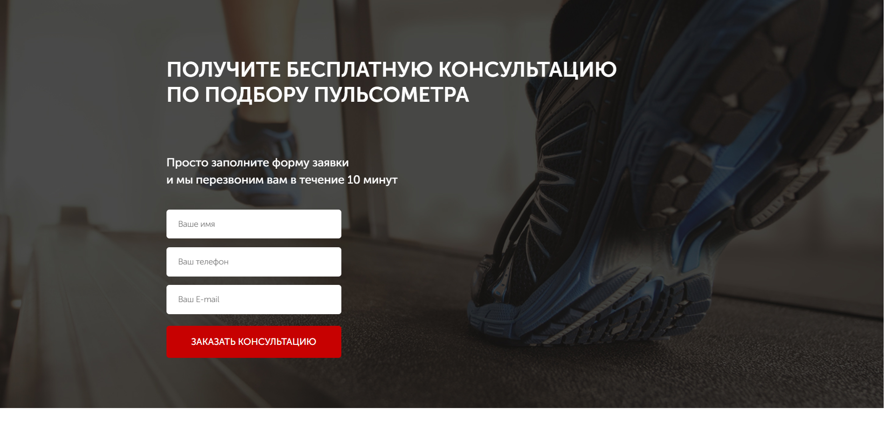
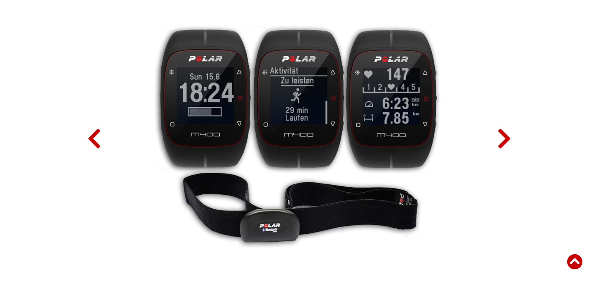
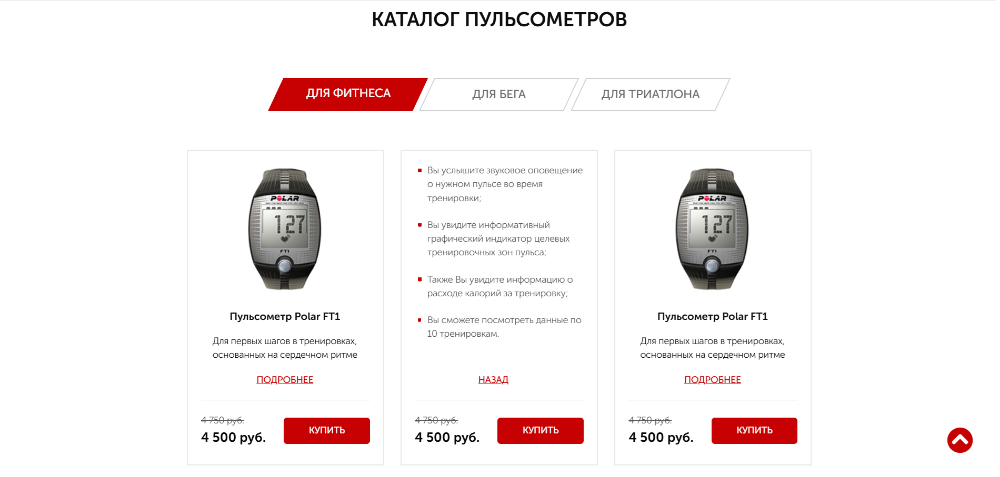
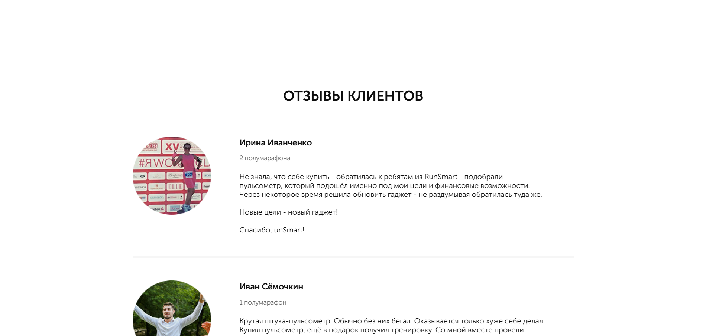
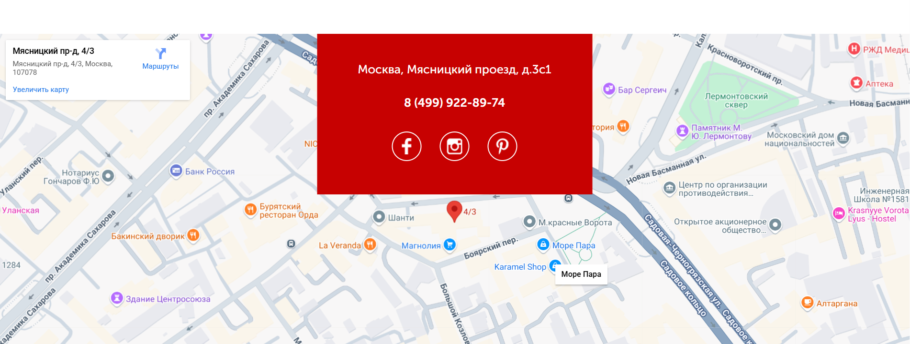
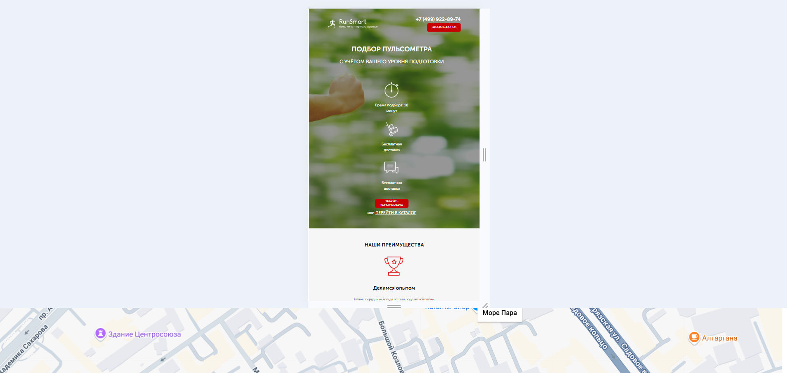
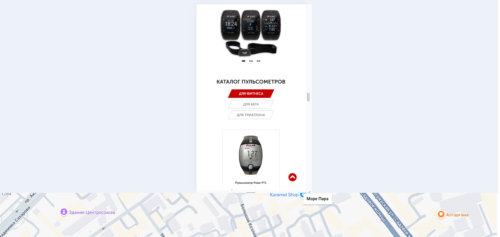

# Структура проекта

**Основные каталоги:**

```
dist/
    css/
    fonts/
    icons/
    img/
    js/
    mailer/
    index.html
src/
    css/
    fonts/
    icons/
    img/
    js/
    mailer/
    sass/
    index.html
gulpfile.js
package.json
package-lock.json
README.md

```

=======

# Pulse (JavaScript + SCSS)










## О проекте

Pulse - сайт магазина спортивных часов. На сайте реализован слайдер, табы и вкладки; данные, которые ввел пользователь в форме, отправятся на адрес электронной почты с помощью smart.php. С помощью media-запросов выполнена адаптация под средние и мобильные устройства. Использован таск-менеджер Gulp.

## Технологии

- JavaScript
- gulp
- SCSS
- php отправка данных с формы на электронную почту
- media-запросы

## Установка и запуск

```bash
git clone https://github.com/NikRNN/Pulse.git
cd Pulse
npm install
gulp (для отправки данных использовать open server)
```
